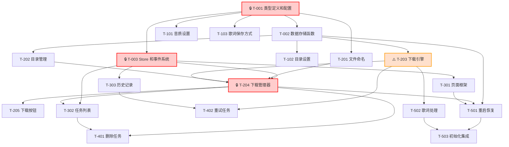

# 下载管理功能任务规划文档

## 概述

将 [下载管理功能技术方案](download-management_技术方案.md) 拆解为可执行的开发任务清单，采用**垂直切片**策略，每个切片对应一个可独立验证的用户行为。

**需求文档**：[specs/features/download-management.md](download-management.md)
**技术设计**：[specs/features/download-management_技术方案.md](download-management_技术方案.md)

---

## 切片总览

```
[切片 0: 基础设施] → [切片 1: 配置下载设置] → [切片 2: 触发下载] → [切片 3: 查看下载进度] → [切片 4: 管理下载任务] → [切片 5: 重启恢复 & 歌词处理]
```

| 切片 | 任务数 | 关键任务 | 可验证行为 |
|------|--------|---------|-----------|
| 切片 0：基础设施 | 3 | T-001, T-003 | 类型、存储、Store 就绪 |
| 切片 1：配置下载设置 | 4 | T-101 | 设置页面可配置下载选项 |
| 切片 2：触发下载 | 5 | T-203, T-204, T-205 | 点击下载按钮后文件开始下载 |
| 切片 3：查看下载进度 | 3 | T-302 | 进入下载页面看到任务和进度 |
| 切片 4：管理下载任务 | 2 | T-401 | 删除任务后文件和记录消失 |
| 切片 5：重启恢复 & 歌词 | 3 | T-502 | 重启后任务保留，歌词正确保存 |

**总计**：20 个任务

---

## 切片详细任务

### 🔧 切片 0：基础设施（薄层）

**通俗解释**：准备好类型定义、状态存储和配置项，让后面的切片能在此基础上构建功能。

---

#### T-001 🔒 扩展类型定义和配置

- **对应技术方案**：§2.1 类型定义扩展 + §2.2 配置项扩展 + §2.3 持久化存储 Key
- **通俗解释**：下载任务和历史记录的字段、下载设置项、存储 Key
- **依赖**：无
- **AC 覆盖**：AC-005, AC-006, AC-007, AC-015

**验证标准**：

1. `src/types/download_list.d.ts` 新增 `DownloadHistoryItem` 接口，字段包含 `id: string`、`musicInfo: LX.Music.MusicInfoOnline`、`quality: LX.Quality`、`ext: FileExt`、`fileName: string`、`filePath: string | null`、`status: 'completed' | 'failed'`、`downloadedSize: number`、`fileSize: number`、`addedTime: number`、`completedTime: number | null`、`errorMessage: string | null`
2. `src/config/defaultSetting.ts` 新增 3 个默认配置：`'download.quality': '128k'`、`'download.savePath': null`、`'download.lyricType': 'embed'`
3. `src/config/constant.ts` `storageDataPrefix` 新增 3 个 Key：`downloadTask: '@download_task__'`、`downloadHistory: '@download_history'`、`downloadSavePath: '@download_save_path'`
4. `src/config/constant.ts` `NAV_MENUS` 数组中取消注释并新增 `{ id: 'nav_download', icon: 'download-2' }`
5. `src/types/app_setting.d.ts` 中 `AppSetting` 类型新增 `'download.quality': LX.Quality`、`'download.savePath': string | null`、`'download.lyricType': 'embed' | 'separate'` 字段

---

#### T-002 新增下载数据存储函数

- **对应技术方案**：§2.4 存储操作接口
- **通俗解释**：读写下载任务列表和历史记录的本地存储函数
- **依赖**：T-001
- **AC 覆盖**：AC-006, AC-016

**验证标准**：

1. `src/utils/data.ts` 新增 `getDownloadTasks`：调用 `getData('@download_task__')`，返回 `LX.Download.ListItem[]`，无数据时返回 `[]`
2. 新增 `saveDownloadTasks`：调用 `saveData('@download_task__', tasks)`
3. 新增 `getDownloadHistory`：调用 `getData('@download_history')`，返回 `LX.Download.DownloadHistoryItem[]`，无数据时返回 `[]`
4. 新增 `saveDownloadHistory`：调用 `saveData('@download_history', history)`
5. 新增 `getDownloadSavePath`：调用 `getData('@download_save_path')`，返回 `string | null`
6. 新增 `setDownloadSavePath`：调用 `saveData('@download_save_path', path)`

---

#### T-003 🔒 注册下载 Store 和事件系统

- **对应技术方案**：§4.1 Store 结构 + §4.2 Actions + §4.3 Hooks + §4.4 Events
- **通俗解释**：下载状态的管理中心和事件通道
- **依赖**：T-001
- **AC 覆盖**：AC-002

**验证标准**：

1. `src/store/download/state.ts` 导出 `InitState` 接口，初始值包含 `tasks: []`、`history: []`、`isInitialized: false`
2. `src/store/download/action.ts` 导出 `setTasks(tasks)` 触发 `downloadListUpdate` 事件、`setHistory(history)` 触发 `downloadHistoryUpdate` 事件、`addTask(task)` 追加到 tasks、`updateTask(id, updates)` 合并更新、`removeTask(id)` 从 tasks 移除、`addHistory(item)` 追加到 history、`removeHistory(ids)` 从 history 移除、`clearHistory()` 清空 history
3. `src/store/download/hook.ts` 导出 `useDownloadTasks()` 返回 `state.tasks`，监听 `downloadListUpdate` 事件、`useDownloadHistory()` 返回 `state.history`，监听 `downloadHistoryUpdate` 事件
4. `src/event/downloadEvent.ts` 导出 `downloadEvent` 实例，方法包含 `downloadListUpdate()`、`downloadHistoryUpdate()`
5. `src/store/index.ts` 注册 download store，导出 `downloadState`

---

### ⚙️ 切片 1：配置下载设置

**通俗解释**：用户在设置页面选择下载音质、下载目录和歌词保存方式，选择后立即生效，下次下载时使用这些配置。

---

#### T-101 下载音质设置组件

- **对应技术方案**：§6.3 设置页面新增下载分类 → DownloadQuality.tsx
- **通俗解释**：设置页面上选择 128k/320k/flac 等音质选项
- **依赖**：T-001
- **AC 覆盖**：AC-005

**验证标准**：

1. `src/screens/Home/Views/Setting/settings/Download/DownloadQuality.tsx` 组件渲染
2. 使用 `useSettingValue('download.quality')` 读取当前值
3. 显示 4 个音质选项：128k、320k、flac、flac24bit（参照 `PlayHighQuality.tsx` 模式，使用 CheckBox 组件）
4. 点击选项后调用 `updateSetting({ 'download.quality': newQuality })`
5. 选中项有视觉高亮差异（选中态背景色或边框变化）
6. 标题显示 `t('download_quality_label')`

---

#### T-102 下载目录设置组件

- **对应技术方案**：§6.3 → DownloadPath.tsx
- **通俗解释**：设置页面上点击「选择目录」按钮，弹出文件选择器选择保存位置
- **依赖**：T-001, T-002
- **AC 覆盖**：AC-006

**验证标准**：

1. `src/screens/Home/Views/Setting/settings/Download/DownloadPath.tsx` 组件显示当前下载目录路径（若 `download.savePath` 为 null 则显示「默认目录」）
2. 显示「选择目录」按钮（国际化 `t('download_path_btn')`）
3. 点击按钮弹出 `ChoosePath` 组件（复用 `src/components/common/ChoosePath/List.tsx`），`dirOnly=true`
4. 用户选择目录后调用 `setDownloadSavePath(path)` 存储，同时调用 `updateSetting({ 'download.savePath': path })`
5. 显示当前选中路径的文本（超过宽度时省略）

---

#### T-103 歌词保存方式组件

- **对应技术方案**：§6.3 → DownloadLyricType.tsx
- **通俗解释**：设置页面上勾选「保存为独立 .lrc 文件」，不勾选时歌词嵌入音频文件
- **依赖**：T-001
- **AC 覆盖**：AC-007

**验证标准**：

1. `src/screens/Home/Views/Setting/settings/Download/DownloadLyricType.tsx` 组件使用 `useSettingValue('download.lyricType')` 读取当前值
2. 标题显示 `t('download_lyric_label')`
3. 两个 CheckBox 选项：「嵌入音频文件元数据」（对应 `'embed'`）和「保存为独立 .lrc 文件」（对应 `'separate'`）
4. 切换后调用 `updateSetting({ 'download.lyricType': newValue })`
5. 同一时间仅一个选项被勾选（互斥逻辑）

---

#### T-104 下载设置聚合入口

- **对应技术方案**：§6.3 → settings/Download/index.tsx
- **通俗解释**：设置页面新增「下载」分类，聚合以上 3 个组件
- **依赖**：T-101, T-102, T-103

**验证标准**：

1. `src/screens/Home/Views/Setting/settings/Download/index.tsx` 按顺序渲染 `DownloadQuality`、`DownloadPath`、`DownloadLyricType`，使用 Section 组件包裹
2. 在 Setting 的横屏/竖屏导航列表（`NavList.tsx`）中新增「下载」入口（国际化 `t('setting_download')`）
3. 点击「下载」导航项后切换到 Download 设置页（参照 `Main.tsx` 中 SETTING_SCREENS 的处理方式）
4. 各子组件在页面中正确显示，无报错

---

### 🚀 切片 2：触发下载

**通俗解释**：用户在歌曲列表中点击「下载」按钮，歌曲开始下载到本地，使用设置中配置的音质和目录。

---

#### T-201 文件命名模块

- **对应技术方案**：§3.4 文件命名模块
- **通俗解释**：根据「歌名 - 歌手」格式生成音频文件名，处理非法字符
- **依赖**：T-001
- **AC 覆盖**：AC-015

**验证标准**：

1. `src/core/download/filename.ts` 导出 `generateFileName(musicInfo, quality, ext)` 函数
2. 读取设置 `download.fileName`（默认 `'歌名 - 歌手'`）
3. `'歌名 - 歌手'` 格式生成：`${musicInfo.name} - ${musicInfo.singer}.${ext}`
4. 非法字符（`/ \ : * ? " < > |`）替换为 `_`
5. 示例输入：`{ name: '晴天', singer: '周杰伦' }, quality='128k', ext='mp3'` → 输出 `'晴天 - 周杰伦.mp3'`
6. 无歌手时仅使用歌名：`{ name: '纯音乐', singer: '' }` → `'纯音乐.mp3'`

---

#### T-202 目录管理模块

- **对应技术方案**：§3.5 目录管理模块
- **通俗解释**：获取下载目录，若用户设置的目录不可用则回退到默认目录
- **依赖**：T-002
- **AC 覆盖**：AC-006, AC-017

**验证标准**：

1. `src/core/download/directory.ts` 导出 `getSaveDirectory()` 函数：读取 `download.savePath`，若为 null 则返回 `externalStorageDirectoryPath`
2. 导出 `validateDirectory(path)` 函数：调用 `readDir(path)`，成功返回 `{ valid: true }`，异常返回 `{ valid: false, reason: err.message }`
3. 导出 `ensureDirectory(path)` 函数：若目录不存在则调用 `mkdir(path)`
4. 若 `validateDirectory` 返回 `false`，`getSaveDirectory` 回退到 `externalStorageDirectoryPath` 并调用 `toast` 提示用户「下载目录不可用：{reason}，使用默认目录」

---

#### T-203 ⚠️ 下载引擎（核心）

- **对应技术方案**：§3.2 下载引擎 + §8.2 网络异常处理 + §8.1 存储空间检查
- **通俗解释**：真正执行文件下载的核心引擎，管理并发队列，更新下载进度
- **依赖**：T-001, T-002, T-201, T-202
- **AC 覆盖**：AC-003, AC-004, AC-009, AC-011, AC-012

**验证标准**：

1. `src/core/download/engine.ts` 导出 `startDownload(task, onProgress, onComplete, onError)` 函数
2. 内部调用 `downloadFile({ fromUrl: task.metadata.url, toFile: task.metadata.filePath })`
3. `progress` 回调中计算 `progress = bytesWritten / contentLength`，调用 `onProgress({ progress, speed, downloaded, total })`
4. `promise` resolve 后调用 `onComplete(taskId, fileSize)`
5. `promise` reject 后解析错误消息（映射 `ECONNABORTED` → "请求超时"、`ENOTFOUND` → "无法连接到服务器"、`ECONNRESET/ETIMEDOUT` → "网络连接失败"），调用 `onError(taskId, errorMessage)`
6. 导出 `getAvailableStorage()` 函数：调用 `FileSystem.getFSInfo()` 返回可用空间
7. 导出 `checkStorageSpace(requiredSize)` 函数：比较可用空间与 `MIN_REQUIRED_SPACE`（100MB），不足返回 `false`
8. 导出 `enqueueDownload(task, onProgress, onComplete, onError)` 函数：维护一个 `activeCount` 计数器，最多同时运行 3 个任务
9. 队列中有 waiting 任务时，一个任务完成后自动启动下一个

---

#### T-204 🔒 下载管理器

- **对应技术方案**：§3.1 下载管理器
- **通俗解释**：对外提供「添加下载任务」「检查是否在列表中」「删除任务」等接口
- **依赖**：T-003, T-201, T-202, T-203
- **AC 覆盖**：AC-001, AC-008, AC-010, AC-011, AC-012

**验证标准**：

1. `src/core/download/index.ts` 导出 `addTask(musicInfo, quality?)` 函数：
   - 调用 `isMusicInList(musicInfo)` → 若已存在，`toast(t('download_exists_tip'))` 并返回 false
   - 获取设置中的 `download.quality`（若未传 quality 参数）
   - 调用 `getSaveDirectory()` 获取目录
   - 调用 `checkStorageSpace()` → 不足则 `toast(t('download_storage_insufficient'))` 并返回 false
   - 调用 `musicSdk[musicInfo.source].getMusicUrl()` 获取歌曲 URL（参照 `core/music/online.ts`）
   - 调用 `generateFileName()` 生成文件名
   - 创建 `ListItem`，status 根据并发情况设为 `run` 或 `waiting`
   - 调用 `enqueueDownload()` 开始下载
   - 下载进度回调中更新 store 状态（`updateTask`）
   - 下载完成回调中：获取歌词并调用 `saveLyric`，将任务从 tasks 移除，添加到 history（status `completed`）
   - 下载失败回调中：将任务 status 设为 `error`
   - 调用 `downloadEvent.downloadListUpdate()` 触发通知
2. 导出 `isMusicInList(musicInfo)` 函数：遍历 `state.tasks` 和 `state.history`，匹配 `musicInfo.id`，返回 boolean
3. 导出 `deleteTask(taskId)` 函数：从 tasks 或 history 中移除对应任务，调用 `saveDownloadTasks` / `saveDownloadHistory` 持久化，若任务正在下载中调用 `stopDownload(jobId)`，若任务已完成调用 `unlink(filePath)`
4. 导出 `retryTask(taskId)` 函数：从 history 中移除失败任务，重新创建 task 并调用 `addTask`
5. 导出 `clearHistory()` 函数：清空 history 数组，调用 `saveDownloadHistory([])`，触发 `downloadEvent.downloadHistoryUpdate()`
6. 导出 `getTasks()` / `getHistory()` / `getDownloadingCount()`

---

#### T-205 歌曲列表页下载按钮

- **对应技术方案**：§5.2 歌曲列表页下载按钮
- **通俗解释**：歌曲操作菜单中新增「下载」选项
- **依赖**：T-204
- **AC 覆盖**：AC-001, AC-008

**验证标准**：

1. `src/components/OnlineList/listAction.ts` 新增 `handleDownload(musicInfo)` 函数：
   - 调用 `downloadManager.isMusicInList(musicInfo)` → 若已存在，`toast(t('download_exists_tip'))` 并返回
   - 调用 `downloadManager.addTask(musicInfo)` → 成功则 `toast(t('download_add_tip'))`
2. `src/components/OnlineList/ListMenu.tsx` 歌曲操作菜单中新增「下载」菜单项（图标 `download-2`）
3. 点击「下载」后调用 `handleDownload`
4. 对已下载的歌曲（如本地音乐 `source === 'local'`），不显示下载按钮

---

### 👁️ 切片 3：查看下载进度

**通俗解释**：用户进入「下载」页面，看到当前下载任务的实时进度和历史记录。

---

#### T-301 下载页面基础框架

- **对应技术方案**：§5.3 下载管理页面 + §6.1 启用下载导航标签 + §6.2 更新主页 Main 组件
- **通俗解释**：底部导航栏新增「下载」标签，进入后显示空列表提示
- **依赖**：T-003
- **AC 覆盖**：AC-002

**验证标准**：

1. 重写 `src/screens/Home/Views/Download/index.tsx`，显示页面标题（国际化 `t('download_title')`）
2. 包含两个 Tab：「当前任务」和「历史记录」（使用项目现有的 Tab 组件模式）
3. 空状态时显示「暂无下载任务」文案（居中显示）
4. `src/screens/Home/Vertical/Main.tsx` 中 `viewMap` 新增 `nav_download: 4`，`indexMap` 新增对应项，设置页改为 5
5. `src/screens/Home/Vertical/Main.tsx` 的 `PagerView` 中新增 `<View key="nav_download">` 包含 `<DownloadPage />`
6. `src/screens/Home/Horizontal/Main.tsx` 同步添加下载页面到 Aside 或对应位置
7. 底部导航栏显示「下载」图标和文字

---

#### T-302 下载任务列表组件

- **对应技术方案**：§5.3 下载管理页面 → DownloadList + DownloadListItem
- **通俗解释**：当前下载任务的列表，显示歌曲名、进度条、状态、删除按钮
- **依赖**：T-003, T-204, T-301
- **AC 覆盖**：AC-002, AC-003

**验证标准**：

1. `src/screens/Home/Views/Download/DownloadList.tsx` 使用 `useDownloadTasks()` 获取任务列表
2. 使用 `FlatList` 渲染任务列表（参照 `src/components/OnlineList/List.tsx` 的 FlatList 模式）
3. `src/screens/Home/Views/Download/DownloadListItem.tsx` 组件渲染单个任务：
   - 歌曲名（`musicInfo.name`）
   - 进度条（使用 `src/components/common/Slider.tsx` 或项目现有 ProgressBar）
   - 状态文字：根据 `status` 显示 `t('download_status_downloading')` / `t('download_status_waiting')` / `t('download_status_failed')`
   - 下载速度（`speed` 字段）
   - 删除按钮（右侧，点击触发 T-401 的删除逻辑）
4. 监听 `downloadEvent.downloadListUpdate` 事件，实时更新列表
5. 列表项高度与项目现有 `LIST_ITEM_HEIGHT` 一致

---

#### T-303 历史记录列表组件

- **对应技术方案**：§5.3 → HistoryList
- **通俗解释**：已完成和失败的下载任务历史记录
- **依赖**：T-003, T-301
- **AC 覆盖**：AC-004, AC-009

**验证标准**：

1. `src/screens/Home/Views/Download/HistoryList.tsx` 使用 `useDownloadHistory()` 获取历史记录
2. 列表项显示：歌曲名、文件大小、完成时间、状态（已完成/失败）
3. 已完成的任务：显示文件大小、删除按钮
4. 失败的任务：显示错误消息、重试按钮、删除按钮
5. 页面顶部或底部有「清空历史记录」按钮：点击后弹出确认对话框（国际化 `t('download_clear_history_confirm')`），确认后调用 `clearHistory`
6. 清空历史时不删除已下载的文件（仅清空 store 和 AsyncStorage）

---

### 🗑️ 切片 4：管理下载任务

**通俗解释**：用户可以在下载页面删除任务、重试失败的任务、清空历史记录。

---

#### T-401 删除任务功能

- **对应技术方案**：§7.3 删除任务流程
- **通俗解释**：删除下载任务，如果文件已下载完成则同时删除文件
- **依赖**：T-204, T-302
- **AC 覆盖**：AC-010

**验证标准**：

1. 点击任务列表中的删除按钮，弹出确认对话框（国际化 `t('download_delete_confirm')`）
2. 确认后调用 `deleteTask(taskId)`（已在 T-204 中实现）
3. 若任务正在下载中，调用 `stopDownload(jobId)` 停止下载
4. 若任务已完成（有文件路径），调用 `unlink(filePath)` 删除文件
5. 从 store 中移除，持久化到 AsyncStorage
6. 列表刷新，任务消失

---

#### T-402 重试失败任务功能

- **对应技术方案**：§3.1 DownloadManager.retryTask
- **通俗解释**：下载失败的任务，点击重试后重新下载
- **依赖**：T-203, T-303
- **AC 覆盖**：AC-009

**验证标准**：

1. 历史记录中失败的任务显示「重试」按钮（国际化 `t('download_retry')`）
2. 点击重试后调用 `retryTask(taskId)`（已在 T-204 中实现）
3. 将任务从 history 移回 tasks，status 设为 `run` 或 `waiting`
4. 重新调用 `startDownload` 开始下载
5. 下载页面自动切换到「当前任务」Tab（或 toast 提示「已重新开始下载」）
6. 进度实时更新

---

### 🔄 切片 5：重启恢复 & 歌词处理

**通俗解释**：应用重启后，已完成的下载任务保留，未完成的标记为失败；下载完成后歌词按设置保存。

---

#### T-501 应用重启恢复

- **对应技术方案**：§7.2 应用重启恢复
- **通俗解释**：打开应用时，下载页面恢复上次的数据，未完成的任务标记为失败可重试
- **依赖**：T-002, T-204, T-301
- **AC 覆盖**：AC-016

**验证标准**：

1. `src/core/download/index.ts` 导出 `init()` 函数
2. `init()` 中调用 `getDownloadTasks()` 和 `getDownloadHistory()`
3. 将已加载的 tasks 中 status 非 `completed` 的任务标记为 `error`（因为它们没有被实际下载）
4. 将已完成的 tasks 移入 history
5. 调用 `saveDownloadTasks()` 和 `saveDownloadHistory()` 持久化
6. 设置 `isInitialized = true`
7. 下载页面读取初始化后的数据，显示正确的状态

---

#### T-502 歌词处理模块

- **对应技术方案**：§3.3 歌词处理模块
- **通俗解释**：歌曲下载完成后，歌词嵌入音频文件或生成 .lrc 文件
- **依赖**：T-203
- **AC 覆盖**：AC-014

**验证标准**：

1. `src/core/download/lyric.ts` 导出 `fetchLyric(musicInfo)` 函数：调用 `musicSdk[musicInfo.source].getLyric()` 获取歌词
2. 导出 `saveLyric(lyricInfo, filePath, lyricType)` 函数
3. `lyricType === 'embed'` 时：调用 `writeLyric(filePath, lyricInfo.lyric)`（来自 `react-native-local-media-metadata`）
4. `lyricType === 'separate'` 时：生成 `.lrc` 文件路径（`${filePath.replace(/\.\w+$/, '')}.lrc`），调用 `writeFile(lrcPath, lyricInfo.lyric)`
5. 下载完成流程中（T-204 的 onComplete 回调），在文件下载成功后调用 `saveLyric`
6. 若歌词获取失败，不影响文件下载成功状态，仅调用 `console.warn` 记录日志

---

#### T-503 应用初始化集成

- **对应技术方案**：§7.2 应用重启恢复（集成到 app.ts 初始化流程）
- **通俗解释**：应用启动时自动初始化下载模块
- **依赖**：T-501, T-502

**验证标准**：

1. 在 `src/core/init/index.ts` 中导入并调用 `downloadManager.init()`
2. 初始化在导航推送 Home 页面之前完成
3. 应用启动后进入下载页面，能看到恢复的任务和历史记录

---

## 任务依赖图



---

## AC 覆盖检查表

| AC 编号 | 对应任务 | 覆盖状态 |
|---------|---------|---------|
| AC-001 | T-204, T-205 | ✅ |
| AC-002 | T-003, T-301, T-302 | ✅ |
| AC-003 | T-203, T-302 | ✅ |
| AC-004 | T-203, T-303 | ✅ |
| AC-005 | T-001, T-101 | ✅ |
| AC-006 | T-001, T-002, T-102, T-202 | ✅ |
| AC-007 | T-001, T-103 | ✅ |
| AC-008 | T-204, T-205 | ✅ |
| AC-009 | T-203, T-303, T-402 | ✅ |
| AC-010 | T-204, T-401 | ✅ |
| AC-011 | T-203, T-204 | ✅ |
| AC-012 | T-203, T-204 | ✅ |
| AC-013 | T-204, T-303 | ✅ |
| AC-014 | T-204, T-502 | ✅ |
| AC-015 | T-001, T-201 | ✅ |
| AC-016 | T-002, T-204, T-501 | ✅ |
| AC-017 | T-202 | ✅ |

**17/17 条 AC 均已覆盖。**

---

## 国际化文案任务

以下文案需在对应切片中添加至 `src/lang/zh-cn.json`、`src/lang/zh-tw.json`、`src/lang/en-us.json`：

| Key | zh-cn | zh-tw | en-us | 关联任务 |
|-----|-------|-------|-------|---------|
| `download_title` | 下载管理 | 下載管理 | Downloads | T-301 |
| `download_add_tip` | 已加入下载队列 | 已加入下載佇列 | Added to download queue | T-205 |
| `download_exists_tip` | 该歌曲已在下载列表中 | 該歌曲已在下載列表中 | This song is already in the download list | T-205 |
| `download_delete_confirm` | 确认删除？已下载的文件将被同时删除 | 確認刪除？已下載的文件將被同時刪除 | Delete? Downloaded files will also be deleted | T-401 |
| `download_clear_history` | 清空历史记录 | 清空歷史記錄 | Clear History | T-303 |
| `download_clear_history_confirm` | 确认清空所有下载历史？已下载的文件将保留 | 確認清空所有下載歷史？已下載的文件將保留 | Clear all download history? Downloaded files will be kept | T-303 |
| `download_status_downloading` | 下载中 | 下載中 | Downloading | T-302 |
| `download_status_waiting` | 等待中 | 等待中 | Waiting | T-302 |
| `download_status_completed` | 已完成 | 已完成 | Completed | T-302 |
| `download_status_failed` | 失败 | 失敗 | Failed | T-302 |
| `download_quality_label` | 默认下载音质 | 預設下載音質 | Default Download Quality | T-101 |
| `download_path_label` | 下载目录 | 下載目錄 | Download Directory | T-102 |
| `download_path_btn` | 选择目录 | 選擇目錄 | Choose Directory | T-102 |
| `download_lyric_label` | 歌词保存方式 | 歌詞保存方式 | Lyric Save Method | T-103 |
| `download_lyric_embed` | 嵌入音频文件元数据 | 嵌入音訊檔案元資料 | Embed in audio metadata | T-103 |
| `download_lyric_separate` | 保存为独立 .lrc 文件 | 儲存為獨立 .lrc 檔案 | Save as separate .lrc file | T-103 |
| `download_storage_insufficient` | 存储空间不足 | 儲存空間不足 | Insufficient storage space | T-204 |
| `download_retry` | 重试 | 重試 | Retry | T-402 |
| `setting_download` | 下载 | 下載 | Download | T-104 |
