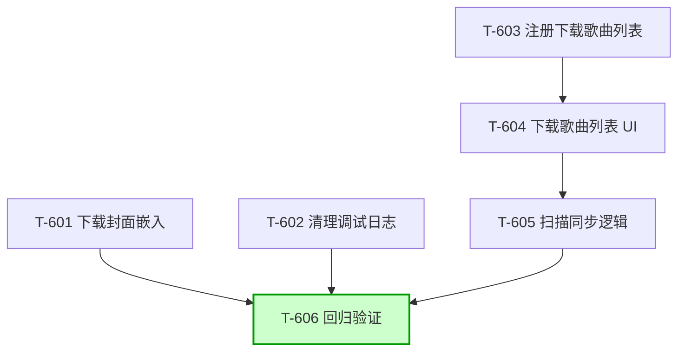

# 下载管理功能变更任务 CR-001

## 变更概述

**变更编号**: CR-001
**变更标题**: 下载功能优化与下载歌曲列表
**变更日期**: 2026-04-25
**变更类型**: 扩展

**变更原因**: 用户要求下载完成后自动嵌入封面、清理调试日志、新增"下载歌曲"系统列表

**影响范围**:
- 新增 6 条验收标准（AC-018 ~ AC-023）
- 新增 6 个增量任务（T-601 ~ T-606）
- 不涉及已完成功能的删除或重写
- 回归验证确保变更不破坏原有功能

---

## 任务列表

| 编号 | 标题 | 类型 | 关键操作 | 依赖 |
|------|------|------|---------|------|
| T-601 | 下载封面嵌入 | 优化 | 下载完成后获取封面 → writePic 写入文件 | 无 |
| T-602 | 清理调试日志 | 整理 | 批量移除 src/core/download/ 下的 log.* 调试调用 | 无 |
| T-603 | 注册下载歌曲列表 | 新功能 | LIST_IDS.DOWNLOAD_MUSIC + isSysList 更新 | 无 |
| T-604 | 下载歌曲列表 UI | 新功能 | ListMenu 条件隐藏 + 新增更新按钮 | T-603 |
| T-605 | 扫描同步逻辑 | 新功能 | 复用本地歌曲扫描逻辑，扫描下载目录 | T-604 |
| T-606 | 回归验证 | 回归 | 跑一遍已有下载功能 + 列表功能，确保无破坏 | T-601, T-602, T-603, T-604, T-605 |

---

## 详细任务

### T-601 下载封面嵌入

- **对应需求文档**: AC-018, AC-019
- **对应技术方案**: §3.6 封面处理模块
- **通俗解释**: 歌曲下载完成后，自动获取在线歌曲的封面图片并嵌入到音频文件的元数据中，其他播放器可以看到封面。

**依赖**: 无

**验证标准**:

1. `src/core/download/index.ts` 的 `addTaskWithDownload` 函数中，下载完成回调（onComplete）追加封面处理逻辑
2. 调用 `musicSdk[musicInfo.source].getPic(musicInfo)` 获取在线歌曲封面 URL
3. 若封面 URL 获取成功，调用 `writePic(filePath, picUrl)`（来自 `react-native-local-media-metadata`）写入音频文件
4. `writePic` 调用成功：无额外操作，文件状态保持「已完成」
5. `writePic` 调用失败：不阻断下载流程，调用 `log.warn('[Download] Failed to embed pic:', err)` 记录日志
6. 封面 URL 获取失败（`getPic` 返回空或异常）：调用 `log.warn` 记录日志，不阻断流程
7. 确保 `src/core/download/engine.ts` 导入了 `writePic`（来自 `react-native-local-media-metadata`）

---

### T-602 清理调试日志

- **对应需求文档**: 无（代码整理任务）
- **对应技术方案**: 无
- **通俗解释**: 移除开发阶段添加的所有 `log.info` / `log.warn` 调试调用，保持代码整洁。

**依赖**: 无

**验证标准**:

1. `src/core/download/index.ts` 中移除所有 `log.info('[addTaskWithDownload] ...')` 调试调用
2. `src/core/download/index.ts` 中移除所有 `log.info('[Download] ...')` 调试调用
3. `src/core/download/engine.ts` 中移除所有 `log.info('[checkStorageSpace] ...')` 调试调用
4. `src/core/download/engine.ts` 中移除所有 `log.info('[saveLyricFile] ...')` 调试调用
5. 保留必要的错误日志（`log.warn` / `log.error`）用于生产环境问题排查：
   - 封面嵌入失败日志保留
   - 歌词保存失败日志保留
   - 目录验证失败日志保留
6. 移除 `import { log } from '@/utils/log'`（若文件中无其他 log 调用）
7. 代码编译无报错，应用正常运行

---

### T-603 注册下载歌曲列表

- **对应需求文档**: AC-020
- **对应技术方案**: §3.7 下载歌曲列表模块
- **通俗解释**: 在系统列表中注册"下载歌曲"列表 ID，使其在"我的列表"中固定显示。

**依赖**: 无

**验证标准**:

1. `src/config/constant.ts` 中 `LIST_IDS` 对象新增 `DOWNLOAD_MUSIC: 'download_music'`
2. `src/utils/listManage.ts` 中 `isSysList(listId)` 函数新增 `listId === LIST_IDS.DOWNLOAD_MUSIC` 判断
3. `src/store/list/state.ts` 中 `defaultList` 初始化时包含 `download_music` 列表项（空歌曲数组）：
   ```typescript
   {
     id: 'download_music',
     name: '下载歌曲',
     songs: [],
     source: 'local',
     locationUpdateTime: Date.now(),
   }
   ```
4. `defaultList` 在列表数组中的位置：位于 `temp`（临时列表）之后，`userLists` 之前
5. 编译无报错，"我的列表"页面能正确显示"下载歌曲"列表项

---

### T-604 下载歌曲列表 UI

- **对应需求文档**: AC-020, AC-021
- **对应技术方案**: §3.7 下载歌曲列表模块 → UI 层限制逻辑
- **通俗解释**: "下载歌曲"列表是系统列表，不允许重命名、不允许添加本地歌曲，但提供"更新"按钮来同步下载目录中的文件。

**依赖**: T-603

**验证标准**:

1. `src/screens/Home/Views/Mylist/MyList/ListMenu.tsx` 中，在渲染菜单项时增加 `listId` 判断
2. 若 `listId === LIST_IDS.DOWNLOAD_MUSIC`：
   - 隐藏"重命名"菜单项（参照 `isSysList(listId)` 隐藏删除的逻辑）
   - 隐藏"添加本地歌曲"菜单项（若存在）
3. 若 `listId === LIST_IDS.DOWNLOAD_MUSIC`：新增"更新"菜单项（图标 `refresh` 或 `sync`）
4. 点击"更新"菜单项后调用 `handleUpdateDownloadList()` 函数（T-605 实现）
5. 其他系统列表（default、love、temp）不受影响，仍按原有逻辑显示菜单项
6. 用户列表（非系统列表）不受影响，仍显示重命名、删除等所有菜单项

---

### T-605 扫描同步逻辑

- **对应需求文档**: AC-021, AC-022, AC-023
- **对应技术方案**: §3.7 下载歌曲列表模块 → 扫描同步流程
- **通俗解释**: 点击"更新"按钮后，扫描下载目录中的所有音频文件，读取元数据后添加到"下载歌曲"列表，已有歌曲不重复添加。

**依赖**: T-604

**验证标准**:

1. `src/screens/Home/Views/Mylist/MyList/listAction.ts` 新增 `handleUpdateDownloadList()` 函数
2. 函数流程：
   a. 调用 `getSaveDirectory()` 获取下载目录路径
   b. 调用 `scanAudioFiles(dir)` 扫描目录中的音频文件（来自 `react-native-local-media-metadata`）
   c. 若扫描结果为空（0 个文件），调用 `toast('目录中未找到音频文件')` 并返回
   d. 获取目标列表（`LIST_IDS.DOWNLOAD_MUSIC`）中已有的歌曲，提取所有 `filePath` 作为已存在集合
   e. 过滤掉已存在的文件（根据 `filePath` 去重）
   f. 若过滤后无新文件，调用 `toast('没有新歌曲需要添加')` 并返回
   g. 分批处理新文件（每批 10 个，最多 5 个并发）：
      - 调用 `readMetadata(filePath)` 读取元数据
      - 构建 `MusicInfoLocal` 对象（复用 `buildLocalMusicInfo` 逻辑）
      - 调用 `listMusicAdd('download_music', newMusicInfos)` 添加到列表
   h. 处理完成后触发 `listDataUpdate` 事件刷新列表
3. 扫描过程中显示 loading 状态（参照 `handleImportMediaFile` 的 loading 处理）
4. 去重逻辑：`MusicInfoLocal.id === filePath`，通过对比 filePath 判断歌曲是否已存在
5. 国际化文案：新增 `download_list_update_empty`（目录中未找到音频文件）、`download_list_update_no_new`（没有新歌曲需要添加）

---

### T-606 回归验证

- **对应需求文档**: 全部 AC（AC-001 ~ AC-023）
- **对应技术方案**: 无
- **通俗解释**: 验证本次变更（封面嵌入、日志清理、下载歌曲列表）没有破坏已有的下载功能和列表功能。

**依赖**: T-601, T-602, T-603, T-604, T-605

**验证标准**:

1. **下载核心功能回归**:
   - 点击下载按钮 → 显示"已加入下载队列"提示 → 任务出现在下载管理页面
   - 下载进度实时更新 → 下载完成后文件保存到正确目录
   - 歌词正确保存（嵌入或独立 .lrc 文件）
   - **封面正确嵌入**音频文件元数据（新增验证）
   - 重复下载 → 提示"该歌曲已在下载列表中"
   - 删除任务 → 文件同时删除

2. **下载设置回归**:
   - 配置下载音质 → 新任务使用正确音质
   - 配置下载目录 → 文件保存到指定目录
   - 配置歌词保存方式 → 按设置方式保存歌词

3. **下载歌曲列表回归**:
   - "下载歌曲"列表在"我的列表"中正确显示
   - 列表不可重命名（菜单中无重命名选项）
   - 列表不可添加本地歌曲（菜单中无添加本地歌曲选项）
   - 点击"更新"按钮 → 扫描下载目录 → 歌曲添加到列表
   - 已存在的歌曲不重复添加
   - 空目录 → 提示"目录中未找到音频文件"

4. **代码质量检查**:
   - `npm run lint` 无报错
   - `npm run typecheck` 无类型错误
   - 调试日志已清理，无残留 `log.info` 调用

---

## 任务依赖图



---

## AC 覆盖检查表

| AC 编号 | 对应任务 | 覆盖状态 |
|---------|---------|---------|
| AC-018 | T-601 | ✅ |
| AC-019 | T-601 | ✅ |
| AC-020 | T-603, T-604 | ✅ |
| AC-021 | T-604, T-605 | ✅ |
| AC-022 | T-605 | ✅ |
| AC-023 | T-605 | ✅ |

**6/6 条新增 AC 均已覆盖。**

---

## 国际化文案任务

以下文案需在 T-605 中添加至 `src/lang/zh-cn.json`、`src/lang/zh-tw.json`、`src/lang/en-us.json`：

| Key | zh-cn | zh-tw | en-us | 关联任务 |
|-----|-------|-------|-------|---------|
| `download_list_update` | 更新 | 更新 | Update | T-604 |
| `download_list_update_empty` | 目录中未找到音频文件 | 目錄中未找到音訊檔案 | No audio files found in directory | T-605 |
| `download_list_update_no_new` | 没有新歌曲需要添加 | 沒有新歌曲需要添加 | No new songs to add | T-605 |
