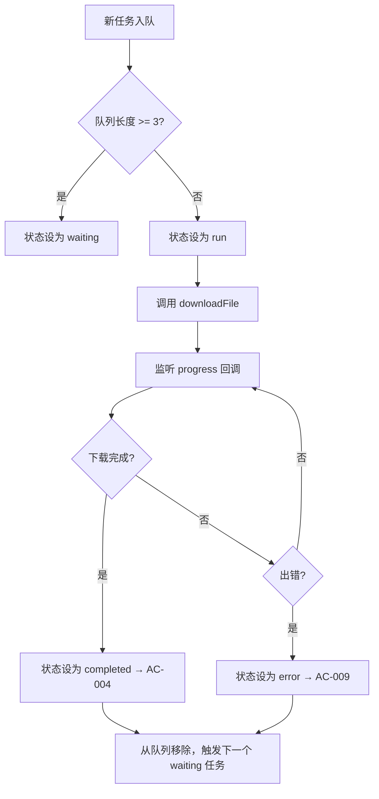
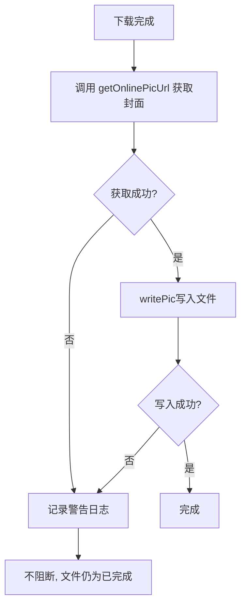
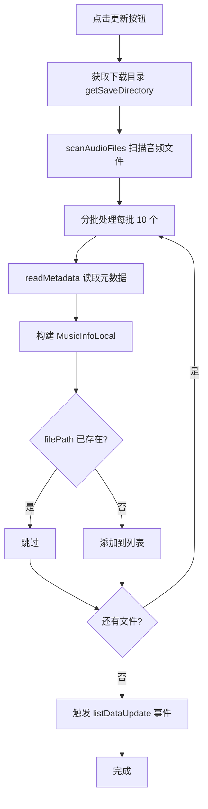
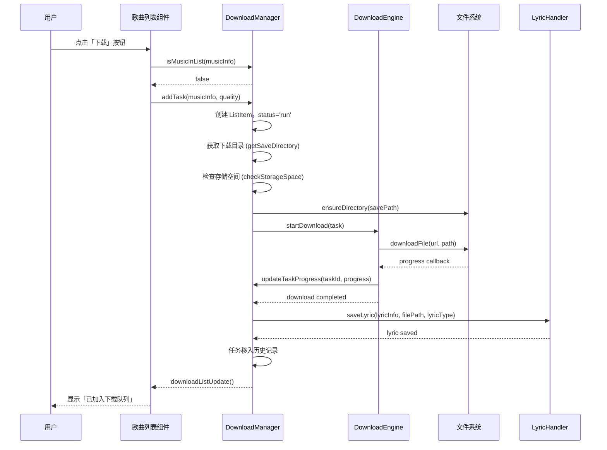
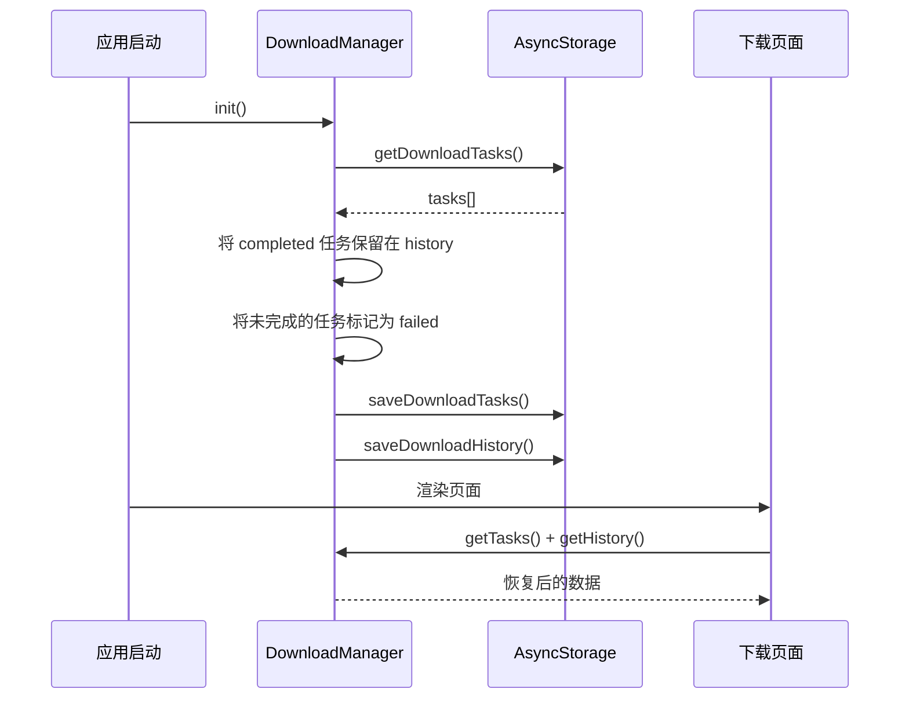
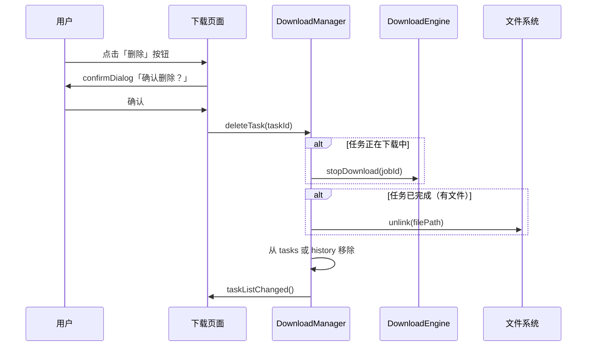

# 下载管理功能技术设计文档

## 概述

本文档描述下载管理功能的技术实现方案，涵盖数据模型、核心模块设计、API 契约、状态管理、持久化存储和 UI 组件。

**需求文档**：[specs/features/download-management.md](specs/features/download-management.md)

---

## 1. 现有代码理解

### 1.1 架构模式

项目采用 **状态层 → 核心逻辑层 → UI 层** 的分层架构：

- **Store 层**（`src/store/`）：In-memory 状态管理，使用 `state.ts` 存储状态、`action.ts` 更新状态、`hook.ts` 提供 React Hooks
- **Core 层**（`src/core/`）：业务逻辑，调用 Store 和插件
- **Event 系统**：通过 `global.state_event` / `global.app_event` 实现模块间通信
- **UI 层**（`src/screens/` + `src/components/`）：组件和页面

### 1.2 数据持久化模式

- 使用 `@react-native-async-storage/async-storage` 存储结构化数据
- `src/utils/data.ts` 封装 `getData` / `saveData` / `removeData` 等操作
- `src/config/constant.ts` 定义 `storageDataPrefix` 前缀常量

### 1.3 设置管理模式

- `src/config/defaultSetting.ts` 定义默认值
- `src/core/common.ts` 的 `updateSetting` 合并设置并触发 `configUpdated` 事件
- 通过 `useSettingValue(key)` Hook 在组件中读取

### 1.4 导航模式

- 使用 `react-native-navigation` 7.x
- 主界面使用 `PagerView` 实现横向滑动分页
- 导航菜单定义在 `src/config/constant.ts` 的 `NAV_MENUS` 数组中

### 1.5 下载相关现有能力

- `src/utils/fs.ts` 提供 `downloadFile` / `stopDownload`（基于 `react-native-fs`）
- `src/core/music/download.ts` 处理已下载歌曲的 URL/封面/歌词获取
- `src/types/download_list.d.ts` 定义了 `DownloadTaskStatus` / `ListItem` / `ProgressInfo` 类型
- `src/event/appEvent.ts` 已有 `downloadListUpdate()` 事件
- `src/screens/Home/Views/Download/index.js` 有占位页面

### 1.6 元数据操作能力

- `react-native-local-media-metadata` 库提供 `writeMetadata` / `writeLyric` / `readLyric` 方法
- 可用于将歌词嵌入音频文件元数据

---

## 2. 数据模型与存储 → AC-001~AC-017

### 2.1 类型定义扩展

**文件**：`src/types/download_list.d.ts`

现有类型已覆盖大部分需求，新增以下类型：

```typescript
declare namespace LX {
  namespace Download {
    // 现有 DownloadTaskStatus, ListItem, ProgressInfo 类型不变

    interface DownloadHistoryItem {
      id: string
      musicInfo: LX.Music.MusicInfoOnline
      quality: LX.Quality
      ext: FileExt
      fileName: string
      filePath: string | null
      status: 'completed' | 'failed'
      downloadedSize: number
      fileSize: number
      addedTime: number
      completedTime: number | null
      errorMessage: string | null
    }

    interface DownloadState {
      tasks: ListItem[]          // 当前活跃任务（下载中/等待中）
      history: DownloadHistoryItem[]  // 下载历史记录
      maxConcurrent: number      // 最大并发数（固定为 3）
    }
  }
}
```

### 2.2 配置项扩展

**文件**：`src/config/defaultSetting.ts`

在默认设置中新增 3 个配置项：

| Key | 类型 | 默认值 | 说明 |
|-----|------|--------|------|
| `download.quality` | `string` | `'128k'` | 默认下载音质 |
| `download.savePath` | `string \| null` | `null` | 自定义下载目录路径 |
| `download.lyricType` | `'embed' \| 'separate'` | `'embed'` | 歌词保存方式 |

### 2.3 持久化存储 Key

**文件**：`src/config/constant.ts`

在 `storageDataPrefix` 中新增：

| Key | 值 | 说明 |
|-----|-----|------|
| `downloadTask` | `'@download_task__'` | 当前活跃下载任务 |
| `downloadHistory` | `'@download_history'` | 下载历史记录 |
| `downloadSavePath` | `'@download_save_path'` | 自定义下载目录 |

### 2.4 存储操作接口

**文件**：`src/utils/data.ts`

新增以下函数，遵循现有 `get*` / `save*` 命名约定：

```typescript
export const getDownloadTasks = async(): Promise<LX.Download.ListItem[]>
export const saveDownloadTasks = async(tasks: LX.Download.ListItem[]): Promise<void>
export const getDownloadHistory = async(): Promise<LX.Download.DownloadHistoryItem[]>
export const saveDownloadHistory = async(history: LX.Download.DownloadHistoryItem[]): Promise<void>
export const getDownloadSavePath = async(): Promise<string | null>
export const setDownloadSavePath = async(path: string | null): Promise<void>
```

→ AC-006, AC-016, AC-017

---

## 3. 核心模块设计

### 3.1 下载管理器（Download Manager）

**文件**：`src/core/download/index.ts`

下载管理器是核心模块，负责任务创建、并发控制、状态流转。

```typescript
interface DownloadManager {
  // 初始化（应用启动时调用）
  init(): Promise<void>

  // 添加下载任务 → AC-001
  addTask(musicInfo: LX.Music.MusicInfoOnline, quality?: LX.Quality): Promise<void>

  // 检查歌曲是否已在下载列表中 → AC-008
  isMusicInList(musicInfo: LX.Music.MusicInfoOnline): boolean

  // 删除任务 → AC-010
  deleteTask(taskId: string, deleteFile?: boolean): Promise<void>

  // 重试失败任务 → AC-009
  retryTask(taskId: string): Promise<void>

  // 清空历史记录 → AC-013
  clearHistory(): Promise<void>

  // 获取当前任务列表
  getTasks(): LX.Download.ListItem[]

  // 获取历史记录
  getHistory(): LX.Download.DownloadHistoryItem[]

  // 获取当前下载中的任务数
  getDownloadingCount(): number
}
```

### 3.2 下载引擎（Download Engine）

**文件**：`src/core/download/engine.ts`

底层下载引擎，封装 `react-native-fs` 的 `downloadFile` API，管理并发队列。

```typescript
interface DownloadEngine {
  // 启动下载任务
  startDownload(task: LX.Download.ListItem): Promise<void>

  // 停止下载
  stopDownload(jobId: number): void

  // 获取可用存储空间
  getAvailableStorage(): Promise<number>

  // 检查存储空间是否足够 → AC-012
  checkStorageSpace(requiredSize: number): Promise<boolean>
}
```

**并发控制逻辑**（Mermaid 流程图）：



→ AC-011

### 3.3 歌词处理模块

**文件**：`src/core/download/lyric.ts`

```typescript
interface LyricHandler {
  // 获取歌词 → AC-014
  fetchLyric(musicInfo: LX.Music.MusicInfoOnline): Promise<LX.Music.LyricInfo>

  // 保存歌词（根据设置决定方式）→ AC-014
  saveLyric(
    lyricInfo: LX.Music.LyricInfo,
    filePath: string,
    lyricType: 'embed' | 'separate'
  ): Promise<void>
}
```

**歌词保存逻辑**：
- `embed` 模式：调用 `react-native-local-media-metadata` 的 `writeLyric(filePath, lyric)` 嵌入元数据
- `separate` 模式：调用 `writeFile(filePath.replace(/\.\w+$/, '.lrc'), lyricContent)` 生成独立文件

→ AC-007, AC-014

### 3.4 文件命名模块

**文件**：`src/core/download/filename.ts`

```typescript
interface FilenameHandler {
  // 根据设置生成文件名 → AC-015
  generateFileName(
    musicInfo: LX.Music.MusicInfoOnline,
    quality: LX.Quality,
    ext: string
  ): string
}
```

**命名规则**（遵循现有 `download.fileName` 配置）：
- `'歌名 - 歌手'`（默认）：`${name} - ${singer}.${ext}`
- 处理文件名中的非法字符（`/ \ : * ? " < > |`）

→ AC-015

### 3.5 目录管理模块

**文件**：`src/core/download/directory.ts`

```typescript
interface DirectoryHandler {
  // 获取当前下载目录 → AC-006
  getSaveDirectory(): Promise<string>

  // 验证目录是否可用 → AC-017
  validateDirectory(path: string): Promise<{ valid: boolean, reason?: string }>

  // 确保目录存在 → AC-017
  ensureDirectory(path: string): Promise<void>
}
```

**逻辑**：
- 若 `download.savePath` 非 null，尝试使用该目录
- 若目录不存在或无权限，回退到 `externalStorageDirectoryPath` 并提示用户
- 使用 `readDir` 验证目录可访问性，`mkdir` 创建子目录

→ AC-006, AC-017

### 3.6 封面处理模块

**文件**: `src/core/download/engine.ts`（复用现有 `writePic`）

歌曲下载完成后，获取在线歌曲的封面 URL 并嵌入音频文件元数据。

**流程**:



**关键逻辑**:
- 封面获取来源：调用 `musicSdk[musicInfo.source].getPic()` 获取在线封面图
- 封面写入：使用 `react-native-local-media-metadata` 的 `writePic(filePath, picUrl)`
- 失败处理：封面嵌入失败不阻断下载流程，文件状态仍为「已完成」

→ AC-018, AC-019

### 3.7 下载歌曲列表模块

**文件**: `src/config/constant.ts` + `src/utils/listManage.ts` + `src/screens/Home/Views/Mylist/MyList/`

在"我的列表"中新增系统级"下载歌曲"列表，自动同步下载目录中的音频文件。

**列表 ID 定义**:
```typescript
// src/config/constant.ts
export const LIST_IDS = {
  DEFAULT: 'default',
  LOVE: 'love',
  TEMP: 'temp',
  DOWNLOAD_MUSIC: 'download_music',  // 新增
}
```

**系统列表识别更新**:
```typescript
// src/utils/listManage.ts
export const isSysList = (listId: string): boolean => {
  return listId === LIST_IDS.DEFAULT ||
    listId === LIST_IDS.LOVE ||
    listId === LIST_IDS.TEMP ||
    listId === LIST_IDS.DOWNLOAD_MUSIC  // 新增
}
```

**UI 层限制逻辑**:

在 `ListMenu.tsx` 中通过 `listId` 判断：
- 若 `listId === LIST_IDS.DOWNLOAD_MUSIC`：隐藏"重命名"、"删除列表"、"添加本地歌曲"菜单项
- 新增"更新"菜单项，绑定 `handleUpdateDownloadList()` 函数

**扫描同步流程**:



**关键逻辑**:
- 扫描目录：使用 `getSaveDirectory()` 获取设置中的下载目录
- 文件扫描：复用 `scanAudioFiles(dir)` 函数（来自 `react-native-local-media-metadata`）
- 元数据读取：复用 `readMetadata(filePath)` 函数
- 去重逻辑：根据 `filePath`（即 `MusicInfoLocal.id`）在目标列表中查找已存在项
- 分批处理：每批 10 个文件，最多 5 个并发（复用 `handleUpdateMusics` 模式）

**新建文件**:
- `src/screens/Home/Views/Mylist/MyList/DownloadListUpdateBtn.tsx` → 更新按钮组件

**修改文件**:
- `src/screens/Home/Views/Mylist/MyList/ListMenu.tsx` → 条件隐藏重命名/添加本地歌曲，新增更新按钮
- `src/screens/Home/Views/Mylist/MyList/listAction.ts` → 新增 `handleUpdateDownloadList()` 扫描同步函数

→ AC-020, AC-021, AC-022, AC-023

---

## 4. 状态管理 → AC-002~AC-004

### 4.1 Store 结构

**文件**：`src/store/download/state.ts`（新建）

```typescript
interface InitState {
  tasks: LX.Download.ListItem[]
  history: LX.Download.DownloadHistoryItem[]
  isInitialized: boolean
}
```

### 4.2 Actions

**文件**：`src/store/download/action.ts`（新建）

```typescript
interface DownloadActions {
  setTasks(tasks: LX.Download.ListItem[]): void
  setHistory(history: LX.Download.DownloadHistoryItem[]): void
  addTask(task: LX.Download.ListItem): void
  updateTask(taskId: string, updates: Partial<LX.Download.ListItem>): void
  removeTask(taskId: string): void
  addHistory(item: LX.Download.DownloadHistoryItem): void
  removeHistory(ids: string[]): void
  clearHistory(): void
}
```

### 4.3 Hooks

**文件**：`src/store/download/hook.ts`（新建）

```typescript
// 获取下载任务列表
export const useDownloadTasks = (): LX.Download.ListItem[]

// 获取历史记录
export const useDownloadHistory = (): LX.Download.DownloadHistoryItem[]

// 获取单个任务状态
export const useDownloadTaskStatus = (taskId: string): LX.Download.DownloadTaskStatus

// 判断歌曲是否已在列表中
export const useMusicInDownloadList = (musicInfo: LX.Music.MusicInfoOnline): boolean
```

### 4.4 Events

**文件**：`src/event/downloadEvent.ts`（新建）

```typescript
class DownloadEvent extends Event {
  // 任务列表变化
  taskListChanged(): void

  // 任务进度更新
  taskProgressUpdated(taskId: string, progress: LX.Download.ProgressInfo): void

  // 任务完成
  taskCompleted(taskId: string): void

  // 任务失败
  taskFailed(taskId: string, error: string): void

  // 历史记录变化
  historyChanged(): void
}
```

---

## 5. API 与交互契约

### 5.1 下载触发入口

下载功能不通过 HTTP API，而是通过**用户交互事件触发**：

```
歌曲列表页 → 点击下载按钮 → core/download.addTask() → 创建任务 → 引擎下载
```

### 5.2 歌曲列表页下载按钮

**文件**：`src/components/OnlineList/ListItem.tsx` 和 `src/components/OnlineList/listAction.ts`

在歌曲操作菜单中新增「下载」选项：

```typescript
// listAction.ts
export const handleDownload = async(musicInfo: LX.Music.MusicInfoOnline) => {
  if (downloadManager.isMusicInList(musicInfo)) {
    toast(global.i18n.t('download_exists_tip'))
    return
  }
  await downloadManager.addTask(musicInfo)
  toast(global.i18n.t('download_add_tip'))
}
```

→ AC-001, AC-008

### 5.3 下载管理页面

**文件**：`src/screens/Home/Views/Download/index.tsx`（重写现有占位文件）

页面结构：
```
Download/index.tsx
├── DownloadList.tsx      // 当前任务列表
├── HistoryList.tsx       // 下载历史记录
└── ClearHistoryBtn.tsx   // 清空历史记录按钮
```

**列表项组件**（每个任务一行）：
```
DownloadListItem
├── 歌曲名 (Text)
├── 进度条 (ProgressBar)
├── 状态文字 / 文件大小 (Text)
├── 重试按钮（仅失败时显示）
└── 删除按钮
```

→ AC-002, AC-003, AC-004, AC-009, AC-010, AC-013

---

## 6. 导航集成 → AC-001~AC-017

### 6.1 启用下载导航标签

**文件**：`src/config/constant.ts`

取消注释下载菜单项：

```typescript
export const NAV_MENUS = [
  { id: 'nav_search', icon: 'search-2' },
  { id: 'nav_songlist', icon: 'album' },
  { id: 'nav_top', icon: 'leaderboard' },
  { id: 'nav_love', icon: 'love' },
  { id: 'nav_download', icon: 'download-2' },  // 新增
  { id: 'nav_setting', icon: 'setting' },
]
```

### 6.2 更新主页 Main 组件

**文件**：`src/screens/Home/Vertical/Main.tsx`

添加下载页面到 PagerView：

```typescript
import Download from '../Views/Download'

const viewMap = {
  nav_search: 0,
  nav_songlist: 1,
  nav_top: 2,
  nav_love: 3,
  nav_download: 4,     // 新增
  nav_setting: 5,      // 索引调整
}
```

### 6.3 设置页面新增下载分类

**文件**：`src/screens/Home/Views/Setting/`

新增 `settings/Download/` 目录，包含：
- `DownloadQuality.tsx` → 默认下载音质选择（参照 `PlayHighQuality.tsx` 模式）
- `DownloadPath.tsx` → 下载目录选择（复用 `ChoosePath` 组件）
- `DownloadLyricType.tsx` → 歌词保存方式（CheckBox 切换）
- `index.tsx` → 聚合以上组件

→ AC-005, AC-006, AC-007

---

## 7. 核心流程实现

### 7.1 添加下载任务流程 → AC-001



### 7.2 应用重启恢复 → AC-016



### 7.3 删除任务流程 → AC-010



---

## 8. 异常处理与边界条件

### 8.1 存储空间不足 → AC-012

在 `DownloadEngine.startDownload` 中：

```typescript
const available = await this.getAvailableStorage()
if (available < MIN_REQUIRED_SPACE) {
  throw new DownloadError('INSUFFICIENT_STORAGE')
}
```

**存储空间计算**：
- Android：使用 `react-native-file-system` 的 `FileSystem.getFSInfo()` 获取可用空间
- 最小需求空间：100MB（根据音质可能更大）

### 8.2 网络异常处理 → AC-009

在 `downloadFile` 的 `begin` 和 `progress` 回调中监听错误：

```typescript
downloadFile({
  fromUrl: url,
  toFile: path,
  progress: (res) => {
    // 更新进度
    updateTaskProgress(taskId, {
      progress: res.bytesWritten / res.contentLength,
      // ...
    })
  },
}).promise.catch((err) => {
  handleDownloadError(taskId, err)
})
```

错误类型映射：
- `ECONNABORTED` → "请求超时"
- `ENOTFOUND` → "无法连接到服务器"
- `ECONNRESET` / `ETIMEDOUT` → "网络连接失败"

### 8.3 目录无效回退 → AC-017

```typescript
const getSaveDirectory = async(): Promise<string> => {
  const customPath = settingState.setting['download.savePath']
  if (!customPath) return externalStorageDirectoryPath

  const { valid, reason } = await validateDirectory(customPath)
  if (!valid) {
    toast(`下载目录不可用：${reason}，使用默认目录`)
    return externalStorageDirectoryPath
  }
  return customPath
}
```

### 8.4 重复下载检测 → AC-008

```typescript
const isMusicInList = (musicInfo: LX.Music.MusicInfoOnline): boolean => {
  return state.tasks.some(t => t.metadata.musicInfo.id === musicInfo.id)
    || state.history.some(h => h.musicInfo.id === musicInfo.id)
}
```

检测范围包括**当前任务**和**历史记录**。

---

## 9. 国际化文案集成

所有文案通过 `src/lang/i18n.ts` 管理，新增文案参考需求文档中的「相关国际化文案」表格。

**文件修改**：
- `src/lang/zh-cn.json`
- `src/lang/zh-tw.json`
- `src/lang/en-us.json`

每个语言文件中追加新的 key-value 对。

---

## 10. AC 覆盖矩阵

| AC 编号 | 技术实现位置 | 关键组件/模块 |
|---------|-------------|--------------|
| AC-001 | DownloadManager.addTask | download/index.ts, download/engine.ts |
| AC-002 | DownloadList 组件 | Views/Download/DownloadList.tsx |
| AC-003 | Progress 事件绑定 | download/engine.ts → store/download |
| AC-004 | 任务完成处理 | download/engine.ts → download/index.ts |
| AC-005 | 下载音质设置 | settings/Download/DownloadQuality.tsx |
| AC-006 | 下载目录设置 | settings/Download/DownloadPath.tsx |
| AC-007 | 歌词保存方式设置 | settings/Download/DownloadLyricType.tsx |
| AC-008 | 重复检测 | DownloadManager.isMusicInList |
| AC-009 | 网络异常重试 | download/engine.ts |
| AC-010 | 删除任务 | DownloadManager.deleteTask |
| AC-011 | 并发控制 | DownloadEngine 队列管理 |
| AC-012 | 存储空间检查 | DownloadEngine.checkStorageSpace |
| AC-013 | 清空历史 | DownloadManager.clearHistory |
| AC-014 | 歌词保存逻辑 | download/lyric.ts |
| AC-015 | 文件命名 | download/filename.ts |
| AC-016 | 重启恢复 | download/index.ts init() |
| AC-017 | 目录验证回退 | download/directory.ts |
| AC-018 | 封面获取与嵌入 | download/engine.ts (onComplete) |
| AC-019 | 封面嵌入失败处理 | download/engine.ts (catch) |
| AC-020 | 下载歌曲列表 UI 限制 | Mylist/MyList/ListMenu.tsx |
| AC-021 | 扫描下载目录同步歌曲 | Mylist/MyList/listAction.ts |
| AC-022 | 歌曲去重逻辑 | Mylist/MyList/listAction.ts |
| AC-023 | 空目录提示 | Mylist/MyList/listAction.ts |

所有 23 条 AC 均已覆盖。

---

## 11. 文件变更清单

### 新建文件

| 文件路径 | 说明 |
|----------|------|
| `src/store/download/state.ts` | 下载状态 |
| `src/store/download/action.ts` | 下载操作 |
| `src/store/download/hook.ts` | 下载 Hooks |
| `src/event/downloadEvent.ts` | 下载事件 |
| `src/core/download/index.ts` | 下载管理器 |
| `src/core/download/engine.ts` | 下载引擎 |
| `src/core/download/lyric.ts` | 歌词处理 |
| `src/core/download/filename.ts` | 文件命名 |
| `src/core/download/directory.ts` | 目录管理 |
| `src/core/download/types.ts` | 类型定义补充 |
| `src/screens/Home/Views/Download/DownloadList.tsx` | 下载任务列表 |
| `src/screens/Home/Views/Download/DownloadListItem.tsx` | 下载任务列表项 |
| `src/screens/Home/Views/Download/HistoryList.tsx` | 历史记录列表 |
| `src/screens/Home/Views/Download/index.tsx` | 下载主页面（重写） |
| `src/screens/Home/Views/Setting/settings/Download/DownloadQuality.tsx` | 下载音质设置 |
| `src/screens/Home/Views/Setting/settings/Download/DownloadPath.tsx` | 下载目录设置 |
| `src/screens/Home/Views/Setting/settings/Download/DownloadLyricType.tsx` | 歌词保存方式 |
| `src/screens/Home/Views/Setting/settings/Download/index.tsx` | 下载设置聚合 |

### 修改文件

| 文件路径 | 变更说明 |
|----------|----------|
| `src/config/defaultSetting.ts` | 新增 3 个下载配置项 |
| `src/config/constant.ts` | 新增 storageDataPrefix，启用 NAV_MENUS 下载项 |
| `src/utils/data.ts` | 新增 5 个下载数据存储函数 |
| `src/types/download_list.d.ts` | 新增 DownloadHistoryItem 类型 |
| `src/types/app_setting.d.ts` | 新增下载配置类型定义 |
| `src/event/appEvent.ts` | 新增 downloadListUpdate 方法（已存在） |
| `src/store/index.ts` | 注册 download store |
| `src/screens/Home/Vertical/Main.tsx` | 添加下载页面到 PagerView |
| `src/screens/Home/Horizontal/Main.tsx` | 横屏模式同步添加下载页面 |
| `src/lang/zh-cn.json` | 新增中文文案 |
| `src/lang/zh-tw.json` | 新增繁体中文文案 |
| `src/lang/en-us.json` | 新增英文文案 |
| `src/components/OnlineList/listAction.ts` | 新增 handleDownload 方法 |
| `src/components/OnlineList/ListMenu.tsx` | 下载菜单项 |
| `src/config/constant.ts` (CR-001) | 新增 DOWNLOAD_MUSIC 列表 ID |
| `src/utils/listManage.ts` (CR-001) | isSysList 新增 download_music 识别 |
| `src/screens/Home/Views/Mylist/MyList/ListMenu.tsx` (CR-001) | 条件隐藏重命名/添加本地歌曲，新增更新按钮 |
| `src/screens/Home/Views/Mylist/MyList/listAction.ts` (CR-001) | 新增 handleUpdateDownloadList 扫描同步函数 |
| `src/screens/Home/Views/Mylist/MyList/DownloadListUpdateBtn.tsx` (CR-001) | 新建更新按钮组件 |
| `src/core/download/index.ts` (CR-001) | 添加封面嵌入逻辑 |
| `src/core/download/engine.ts` (CR-001) | 添加 writePic 导入和封面处理逻辑 |

---

## 12. 依赖项

本次功能**不引入新依赖**，全部使用项目已有库：

| 已有依赖 | 用途 |
|---------|------|
| `react-native-fs` | 文件下载、文件操作 |
| `react-native-file-system` | 目录浏览、存储空间查询 |
| `react-native-local-media-metadata` | 歌词嵌入音频元数据、**封面嵌入 (writePic)** |
| `@react-native-async-storage/async-storage` | 任务持久化存储 |
| `react-native-background-timer` | 下载超时控制 |

---

## 13. 变更日志 (Change Log)

### CR-001: 下载功能优化与下载歌曲列表 (2026-04-25)
**变更类型**: 扩展
**变更原因**: 用户要求下载封面嵌入、清理调试日志、新增下载歌曲列表
**变更内容**:
- 新增 §3.6 封面处理模块（下载完成后自动嵌入封面到音频文件元数据）
- 新增 §3.7 下载歌曲列表模块（系统列表，扫描下载目录同步歌曲）
- §10 AC 覆盖矩阵新增 AC-018 ~ AC-023 映射
- §11 文件变更清单追加 CR-001 新增/修改的 8 个文件
- §12 依赖项更新 writePic 用途说明
